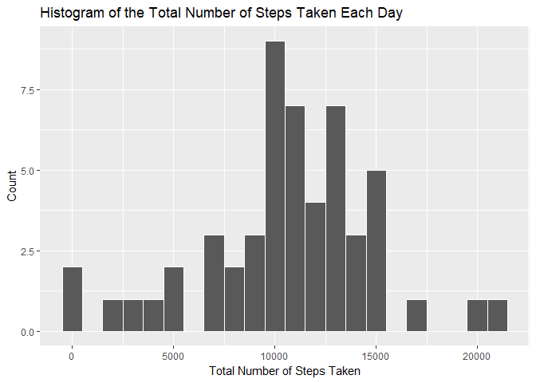
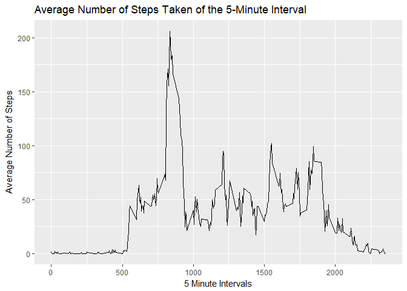
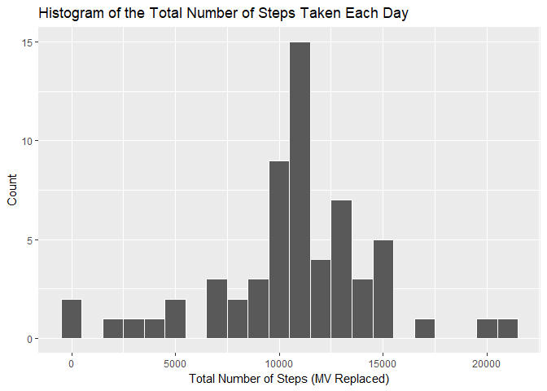
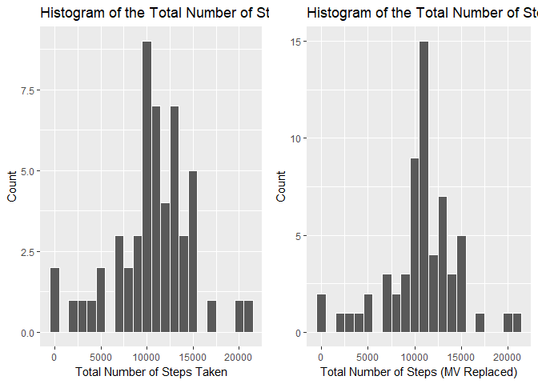
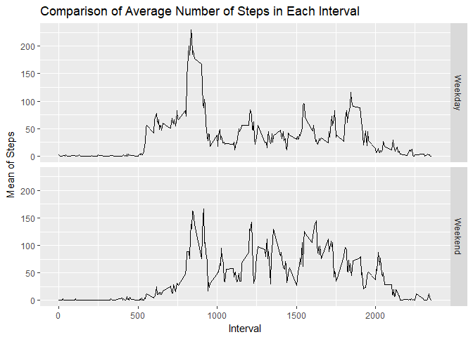

#Introduction

This document showcases the work done for the Reproducible Research Week 2 - Project. 

## Loading the necessary ibraries 

These are the libraries we will be making use of during this project. If these are not already installed, please do so now.


```r
library(ggplot2)
library(dplyr)
```

```
## 
## Attaching package: 'dplyr'
```

```
## The following objects are masked from 'package:stats':
## 
##     filter, lag
```

```
## The following objects are masked from 'package:base':
## 
##     intersect, setdiff, setequal, union
```

```r
library(data.table)
```

```
## 
## Attaching package: 'data.table'
```

```
## The following objects are masked from 'package:dplyr':
## 
##     between, first, last
```

```r
library(grid)
library(gridExtra)
```

```
## 
## Attaching package: 'gridExtra'
```

```
## The following object is masked from 'package:dplyr':
## 
##     combine
```

```r
# For readibility and using pipes
library(magrittr)
```

## Loading data

We can now download, unzip and load our data


```r
# download file from web
download.file("https://d396qusza40orc.cloudfront.net/repdata%2Fdata%2Factivity.zip", destfile = "activity.zip", mode="wb")
# unzip data and read 
unzip("activity.zip")
stepsdata <- read.csv("activity.csv", header = TRUE)
```

First lets have a look at the structure of our dataset


```r
str(stepsdata)
```

```
## 'data.frame':	17568 obs. of  3 variables:
##  $ steps   : int  NA NA NA NA NA NA NA NA NA NA ...
##  $ date    : Factor w/ 61 levels "2012-10-01","2012-10-02",..: 1 1 1 1 1 1 1 1 1 1 ...
##  $ interval: int  0 5 10 15 20 25 30 35 40 45 ...
```

we can also check the summary information for our variables


```r
summary(stepsdata)
```

```
##      steps                date          interval     
##  Min.   :  0.00   2012-10-01:  288   Min.   :   0.0  
##  1st Qu.:  0.00   2012-10-02:  288   1st Qu.: 588.8  
##  Median :  0.00   2012-10-03:  288   Median :1177.5  
##  Mean   : 37.38   2012-10-04:  288   Mean   :1177.5  
##  3rd Qu.: 12.00   2012-10-05:  288   3rd Qu.:1766.2  
##  Max.   :806.00   2012-10-06:  288   Max.   :2355.0  
##  NA's   :2304     (Other)   :15840
```

And finally lets have a look at the first few rows of data


```r
head(stepsdata, 10)
```

```
##    steps       date interval
## 1     NA 2012-10-01        0
## 2     NA 2012-10-01        5
## 3     NA 2012-10-01       10
## 4     NA 2012-10-01       15
## 5     NA 2012-10-01       20
## 6     NA 2012-10-01       25
## 7     NA 2012-10-01       30
## 8     NA 2012-10-01       35
## 9     NA 2012-10-01       40
## 10    NA 2012-10-01       45
```

For easier analysis lets make a copy of the dataset removing the missing values


```r
steps.complete <- na.omit(stepsdata)
```

##Mean number of steps taken per day

For this we need to calculate the sum of steps taken each day


```r
steps.day <- group_by(stepsdata, date)
steps.day <- summarize(steps.day, steps=sum(steps))
```

Now we have a new dataset with total number of steps in each day. We can now produce the histogram


```r
hist1 <- ggplot(data = na.omit(steps.day), aes(steps)) + 
    geom_histogram(binwidth = 1000, colour = "white") +
    xlab("Total Number of Steps Taken") +
    ylab("Count") +
    ggtitle("Histogram of the Total Number of Steps Taken Each Day")
print(hist1)
```

<!-- -->

We can see that most days subjects took around 10,000 - 13,000 steps. But there are also a few days with very few steps taken and only a couple over 20,000 steps. 

##Mean and median of Total Number of Steps Taken per Day


```r
mean(na.omit(steps.day$steps))
```

```
## [1] 10766.19
```


```r
median(na.omit(steps.day$steps))
```

```
## [1] 10765
```

We can see that mean and median are very very close to each other implying a relatively symmetric distribution.

##Number of steps over time (5 min. intervals)

We can further explore the data by plotting a time series illustrating average number of steps taken over five minute intervals.


```r
ts.steps <- aggregate(steps ~ interval, data = stepsdata, FUN =mean)
ts1 <- ggplot(data = ts.steps, aes(x = interval, y = steps)) + 
    geom_line() +
    xlab("5 Minute Intervals") + 
    ylab("Average Number of Steps") +
    ggtitle("Average Number of Steps Taken of the 5-Minute Interval")
print(ts1)
```

<!-- -->

By just eyeballing the graph we can see that Number of steps taken reaches a steep peak of just over 200 steps at around interval 850. Almost no steps are taken until around interval 500 and there is a steep decline at around interval 1800. We can, of course, identify the time interval with the highest number of steps.


```r
ts.steps[which(ts.steps$steps==max(ts.steps$steps)),]
```

```
##     interval    steps
## 104      835 206.1698
```

## Imputing missing values

We can deal with missing values in several ways. The easiest and most convenient is mean imputation. In this procedure we simply replace all missing values with the mean of the variable.In fact if there are groupings such as days, or intervals we can impute use the group mean to replace the missing value. First let's see how many rows of our data have missing values.

1. Calculate and report the total number of missing values in the dataset


```r
sapply(X = stepsdata, FUN = function(x) sum(is.na(x)))
```

```
##    steps     date interval 
##     2304        0        0
```

Remember from earlier when we explored the data using summary function. We confirm the numbar of NAs we reported in that step. 2304 rows in our dataset has missing values. We also see that only *steps* variable has missing values. *date* and *interval* does not have andy missing values. We can concentrate imputing missing values only for *steps*.  

2. Devise a strategy for filling in all of the missing values in the dataset.
3. Create a new dataset that is equal to the original dataset but with the missing data filled in.

**We are combining steps 2 and 3.**

Mean imputation can take more than one shape. We can for example replace missing values with the overall mean of the steps variable. If we did not know anything else about the data this could be acceptable. However we know that there is great variation between time intervals. We can infer that by replacing the missing values by the mean of the number of steps taken during a time interval, we can approximate the real unobserved value more accurately.


```r
mv.stepdata <- stepsdata
mv.stepdata$steps[is.na(mv.stepdata$steps)] <- ave(mv.stepdata$steps, mv.stepdata$interval, FUN=function(x) mean(x, na.rm=T))[is.na(mv.stepdata$steps)]
head(mv.stepdata)
```

```
##       steps       date interval
## 1 1.7169811 2012-10-01        0
## 2 0.3396226 2012-10-01        5
## 3 0.1320755 2012-10-01       10
## 4 0.1509434 2012-10-01       15
## 5 0.0754717 2012-10-01       20
## 6 2.0943396 2012-10-01       25
```

```r
summary(mv.stepdata)
```

```
##      steps                date          interval     
##  Min.   :  0.00   2012-10-01:  288   Min.   :   0.0  
##  1st Qu.:  0.00   2012-10-02:  288   1st Qu.: 588.8  
##  Median :  0.00   2012-10-03:  288   Median :1177.5  
##  Mean   : 37.38   2012-10-04:  288   Mean   :1177.5  
##  3rd Qu.: 27.00   2012-10-05:  288   3rd Qu.:1766.2  
##  Max.   :806.00   2012-10-06:  288   Max.   :2355.0  
##                   (Other)   :15840
```

```r
sum(is.na(mv.stepdata))
```

```
## [1] 0
```

As we can see from the output new dataset has no missing values and its structure is identical to the original dataset.

4. Make a histogram of the total number of steps taken each day and Calculate and report the mean and median total number of steps taken per day. Do these values differ from the estimates from the first part of the assignment? What is the impact of imputing missing data on the estimates of the total daily number of steps? We make a histogram of the total number of steps taken each day first by using the new version dataset


```r
newsteps.day <- group_by(mv.stepdata, date)
newsteps.day <- summarize(newsteps.day, steps=sum(steps))
```

```r
hist2 <- ggplot(data = newsteps.day, aes(steps)) + 
    geom_histogram(binwidth = 1000, colour = "white") +
    xlab("Total Number of Steps (MV Replaced)") +
    ylab("Count") +
    ggtitle("Histogram of the Total Number of Steps Taken Each Day")
print(hist2)
```

<!-- -->

We can see that the overall shape of the distribution has not changed markedly. However, we would rather compare the two histograms side by side for a better interpretation of the changes.


```r
grid.arrange(hist1, hist2, ncol = 2)
```

<!-- -->

And compare the new mean and median to the old.


```r
mean(na.omit(steps.day$steps))
```

```
## [1] 10766.19
```

```r
mean(na.omit(newsteps.day$steps))
```

```
## [1] 10766.19
```

```r
median(na.omit(steps.day$steps))
```

```
## [1] 10765
```

```r
median(na.omit(newsteps.day$steps))
```

```
## [1] 10766.19
```

Since we replaced each missing value with the mean of the corresponding interval the overall mean remains unchanged. However the middle of the distribution shifts about 1 step to the right.

##Comparing weekends and weekdays

We will be using the new imputed dataset. First we need to create a new variable to mark weekdays and weekends

1.Create a new factor variable in the dataset with two levels - "weekday" and "weekend" indicating whether a given date is a weekday or weekend day.


```r
mv.stepdata$weekend <- ifelse(weekdays(as.Date(mv.stepdata$date)) %in% c("Monday", "Tuesday", "Wednesday", "Thursday", "Friday"), "Weekday", "Weekend")
head(mv.stepdata)
```

```
##       steps       date interval weekend
## 1 1.7169811 2012-10-01        0 Weekday
## 2 0.3396226 2012-10-01        5 Weekday
## 3 0.1320755 2012-10-01       10 Weekday
## 4 0.1509434 2012-10-01       15 Weekday
## 5 0.0754717 2012-10-01       20 Weekday
## 6 2.0943396 2012-10-01       25 Weekday
```

2. Make a panel plot containing a time series plot of the 5-minute interval and the average number of steps taken, averaged accross all weekday days, or weekend days.


```r
mv.stepdata <- (mv.stepdata %>% group_by(interval, weekend) %>% summarise(Mean = mean(steps)))
ggplot(mv.stepdata, mapping = aes(x = interval, y = Mean)) + geom_line() +
        facet_grid(weekend ~.) + xlab("Interval") + ylab("Mean of Steps") +
        ggtitle("Comparison of Average Number of Steps in Each Interval")
```

<!-- -->

We can see that people get up later on weekends and stay active until later. Peak activity time is similar for both weekdays and weekends but average activit tend to stay highewr in weekends than in weekdays

***Thank you for reading!***
